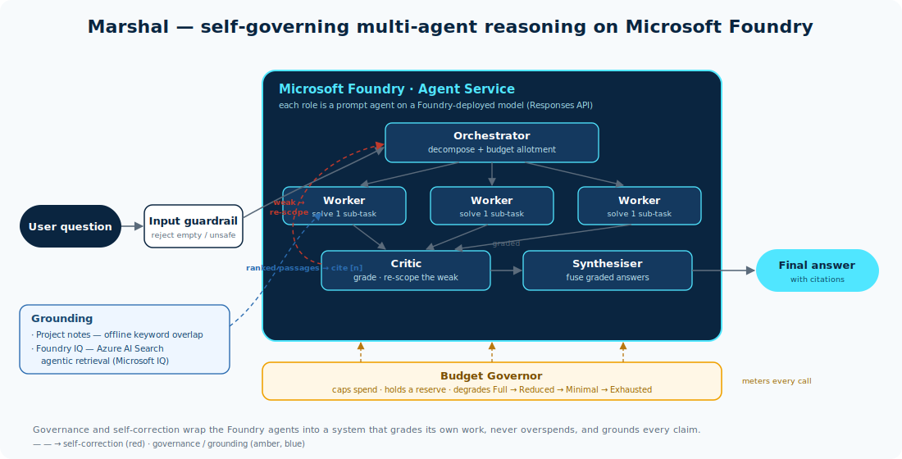

# Marshal

A self-governing multi-agent reasoning system, built on **Microsoft Foundry**.

> Microsoft Agents League Hackathon, Reasoning Agents track. Solo entry.



Marshal is a local-first, single-user AI workspace. You give it a hard question or a
project goal; an orchestrator decomposes it, dispatches workers in parallel, grades
their answers, re-commissions the weak ones, and synthesises a final answer, all under
a hard budget. You watch the whole swarm work, live, on a kanban board.

## The problem

Most agent demos are a single model in a loop, or a naive chain that runs once and hopes
the answer is right. They have no idea how good their own work is, and no limit on what
they will spend getting it. Marshal is built around the opposite idea: an orchestrator
that **budgets and grades its own workers, and fixes their mistakes**.

## What it does

Give it a hard question. It:

1. **Decomposes** the question into scoped sub-tasks (the **Orchestrator**).
2. **Grounds** each sub-task in retrieved knowledge and **dispatches** workers to run them in parallel (the **Workers**).
3. **Grades** every answer and re-scopes and re-runs the weak ones (the **Critic**, driving **self-correction**).
4. **Synthesises** the graded results into one answer, citing its sources.
5. Runs all of it under a hard **Budget Governor** that degrades gracefully rather than failing.

Every stage streams to the UI over a WebSocket, so the board fills in live: the
orchestrator's sub-tasks become cards, workers move them through Doing / Review / Done,
and a **Grounded** badge shows where each answer drew its knowledge from.

## Why it is different

The novel hook is **governance plus self-correction**. The system is honest about
failure (blank and thin answers are detected and re-scoped, not hidden), it never
overspends (a reserve is always held back so it can still answer), and every claim is
grounded in retrieved passages with citations rather than left to the model's memory.

## Grounding (the Microsoft IQ integration)

Each worker is fed ranked passages and asked to cite them as `[n]`. Marshal grounds from
a selectable source, and the source **follows the project**:

- **Project notes** (default) — `LocalGrounding`, offline keyword-overlap retrieval over
  the board's own cards and notes. No model call, no cost, works fully offline.
- **Foundry IQ** — `FoundryIQGrounding`, the Microsoft IQ layer: Azure AI Search agentic
  retrieval over a knowledge base, which plans queries, searches attached sources in
  parallel, and returns ranked grounding documents with citations.
- **None** — ungrounded.

Both the board and the chat expose a source picker, and the citations used are surfaced
in the answer (a Sources panel in the result modal, and under each grounded chat reply).
Grounding sits behind one `Grounding` interface, so the loop never changes to adopt a new
source. See [docs/FOUNDRY_IQ.md](docs/FOUNDRY_IQ.md) for the Foundry IQ setup.

## Architecture

See [docs/ARCHITECTURE.md](docs/ARCHITECTURE.md) for the full design and diagram.

Built on **Microsoft Foundry Agent Service**: each role (orchestrator, worker, critic,
synthesiser) is a Foundry prompt agent, created with the Foundry projects API
(`azure-ai-projects` 2.x) and driven through its OpenAI-compatible Responses API. All
reasoning runs on a model deployed in Foundry (`gpt-5-mini` in this build). A `demo` stub
backend runs the same loop with no connection for an offline fallback, and a Claude CLI
backend is available for local development.

## Tech stack

- **Microsoft Foundry (Azure AI Foundry) Agent Service** for the agents and models
- **Foundry IQ** (Azure AI Search agentic retrieval) for grounded knowledge
- Python, `azure-ai-projects` >= 2.0, `azure-identity`, `openai` (Responses API), `azure-search-documents` (preview, for Foundry IQ)
- **FastAPI** + **uvicorn**, streaming events over a WebSocket
- Single-file vanilla-JS web app (no build step), CSS-variable theming

## Running it

```bash
pip install -r requirements.txt          # add --pre azure-search-documents for Foundry IQ
az login                                  # auth is via DefaultAzureCredential, no keys
cp .env.example .env                      # then set PROJECT_ENDPOINT + your model deployment
python -m uvicorn marshal_ai.server:app --app-dir src --port 8000
```

Open <http://localhost:8000>. Pick a project, hit **Run Marshal**, choose a grounding
source, and watch the swarm work. The chat tab talks to the same backend.

- **`.env`** sets `PROJECT_ENDPOINT`, the four `*_MODEL` deployment names, the budget, and
  swarm sizing. To enable Foundry IQ grounding, also set `SEARCH_ENDPOINT` and
  `KNOWLEDGE_BASE` (see [docs/FOUNDRY_IQ.md](docs/FOUNDRY_IQ.md)); leave them blank to run
  on project-notes grounding only.
- A grounded run on `gpt-5-mini` costs roughly **$0.03** under the default $0.50 budget.

Headless checks (no UI) live in `tests/`:

```bash
python tests/check_foundry.py            # connectivity: one agent + a tiny ask
python tests/run_foundry_test.py "..."   # full loop on Foundry
python tests/run_grounded_demo.py "..."  # full loop grounded on project notes, with citations
```

## Project layout

```
src/marshal_ai/
  server.py     FastAPI app: WebSocket loop stream + chat/suggest/draft/plan endpoints
  loop.py       the reasoning loop: decompose, work, grade, self-correct, synthesise
  agents.py     creates/ensures the Foundry prompt agents for each role
  foundry.py    thin wrapper over the Foundry Agent Service (Responses API)
  grounding.py  Grounding interface: LocalGrounding, FoundryIQGrounding, make_grounding
  budget.py     the Budget Governor (graceful degradation, reserve, tiering)
  config.py     settings from .env, model roles, approximate pricing, Windows PATH fix
  demo.py       offline stub backend that runs the same loop with no connection
  cli_provider.py / anthropic_provider.py   local dev backends (Claude)
web/index.html  the entire single-file web app (board, chat, models, GitHub, settings)
prompts/        the system prompts for each role
docs/           ARCHITECTURE.md and FOUNDRY_IQ.md
tests/          headless connectivity and full-loop checks
```

## Submission checklist (Reasoning Agents track)

- [x] Public GitHub repository with source code and README (this repo)
- [x] Project description (features, functionality, problem solved, technologies)
- [x] Architecture diagram showing use of the Microsoft tools ([docs/ARCHITECTURE.md](docs/ARCHITECTURE.md))
- [x] Microsoft IQ integration (Foundry IQ grounding)
- [ ] Demo video, 5 minutes maximum, on YouTube or Vimeo (link to follow)
- [ ] Microsoft Learn username

## Status

Working end to end. The full reasoning loop runs on Microsoft Foundry, grounded and
budgeted, streaming live to the web UI; Foundry IQ grounding is implemented and verified.
The remaining submission items are the demo video and the Microsoft Learn username.
