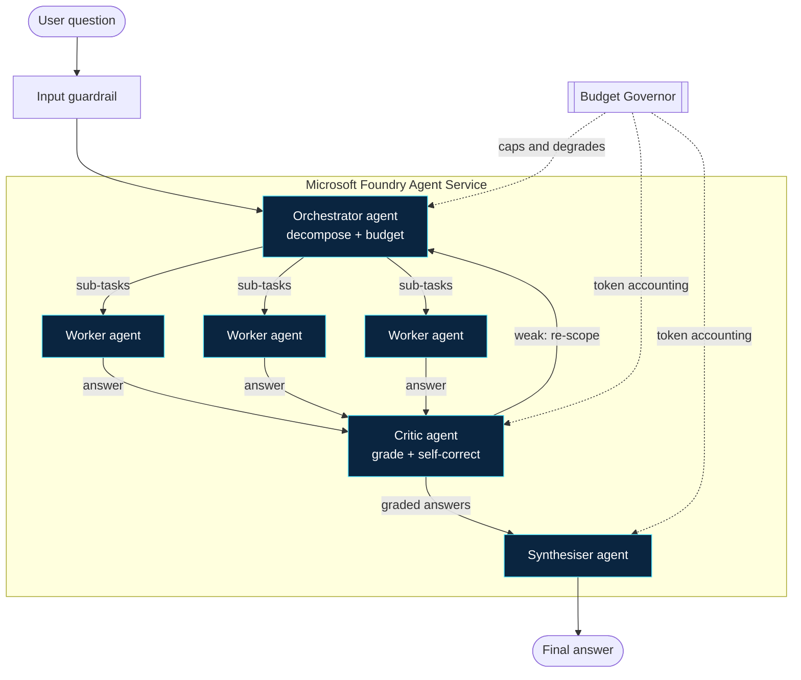

# Marshal: architecture

A self-governing multi-agent reasoning system on Microsoft Foundry. This document
describes the design, the control loop, and the reliability mechanisms, and shows
where the Microsoft tools sit.


## Design in one paragraph

A hard question enters. An **Orchestrator** agent decomposes it into a small set of
scoped sub-tasks and decides, with the **Budget Governor**, how many to dispatch.
**Worker** agents solve the sub-tasks in parallel. A **Critic** agent grades each
answer; weak answers (blank, thin, or low confidence) are re-scoped and
re-commissioned, which is the **self-correction** loop. A **Synthesiser** agent
fuses the graded answers into one final response. The Budget Governor caps total
spend throughout and forces graceful degradation as the budget burns down, always
holding a reserve back so a final answer is guaranteed.

## The agents

All four roles are **Foundry prompt agents**, declared with `PromptAgentDefinition`
and run through the Foundry Responses API. Each runs on a model deployed in the
Foundry project (gpt-5-mini by default; the orchestrator and critic can be raised
to a stronger model independently through config).

| Agent | Job | Output |
|---|---|---|
| **Orchestrator** | Decompose the question into scoped sub-tasks; respect the budget allotment | A strict JSON task plan |
| **Worker** | Solve exactly one scoped sub-task, output-first, ending with a confidence line | A markdown answer |
| **Critic** | Grade each worker answer (strong / thin / blank), decide re-commission | A grade plus a re-scope brief |
| **Synthesiser** | Fuse the graded answers into the final response | The final answer |

The worker charter is ported from the proven Nex lab design: self-contained
prompts, one decision or artefact per task, keep private reasoning short and start
writing immediately (this avoids the failure mode where a thinking model spends all
its tokens reasoning and writes nothing), and always end with a confidence line.

## The control loop

```
answer(question, budget):
    plan        = orchestrator.decompose(question, budget.allotment)
    n           = budget.allot_workers(len(plan.subtasks), MAX_WORKERS)
    results     = parallel_map(worker.solve, plan.subtasks[:n])

    for round in range(MAX_SELF_CORRECTIONS):
        graded  = [critic.grade(r) for r in results]
        weak    = [g for g in graded if g.needs_redo]
        if not weak or not budget.self_correction_allowed():
            break
        rescoped = orchestrator.rescope(weak)        # never reissue verbatim
        results  = replace(results, parallel_map(worker.solve, rescoped))

    return synthesiser.fuse(question, graded)         # paid from the reserve
```

Every call routes through the Budget Governor, which records actual token usage and
can refuse a call that would breach the budget.

## The Budget Governor (the reliability spine)

A per-question USD cap. A reserve fraction is held back from dispatch at all times,
so the synthesis step is always affordable even after the workers run the budget
down. As the workable budget falls, the governor drops through tiers:

| Tier | Workable budget left | Behaviour |
|---|---|---|
| **Full** | over 50% | full worker count, self-correction on |
| **Reduced** | 20% to 50% | half the workers |
| **Minimal** | under 20% | one worker, no self-correction |
| **Exhausted** | reserve only | stop dispatching, synthesise now |

This turns a hard money or rate limit into a smooth quality slope rather than a
crash. The implementation is pure logic in `src/marshal_ai/budget.py` and is
unit-testable without any Azure connection.

## Honest failure handling

Ported from the Nex lab: the system distinguishes a **blank** answer (the model
wrote nothing) from a **stub** (too short to be useful) from a **transient failure**
(rate limit or timeout, retried once) from a real error. Blanks and stubs are
re-scoped into narrower briefs rather than reissued verbatim. The live UI reports
the true filed / blank / failed counts, never a claimed success.

## Input guardrails

Before decomposition, the question passes a lightweight guard: it rejects empty or
abusive input and refuses tasks that need live facts the offline models cannot
supply, stating that limit honestly rather than hallucinating.

## Where the Microsoft tools sit



Every reasoning box runs on **Microsoft Foundry**: a prompt agent on a
Foundry-deployed model, called through the Foundry projects API. The Budget
Governor and guardrail are the application layer that wraps the Foundry agents into
a governed, self-correcting system.

## How this maps to the judging rubric

- **Accuracy and relevance (20%):** built on Foundry front and centre; solves one
  concrete reasoning task end to end; hits every required artefact.
- **Reasoning (20%):** the multi-step thinking is visible: decompose, work, grade,
  self-correct, synthesise.
- **Creativity (15%):** the self-governing, self-correcting orchestrator.
- **User experience (15%):** a live "watch the swarm work" view, a tight demo, a
  polished README and this diagram.
- **Reliability and safety (20%):** the Budget Governor, graceful degradation,
  self-correction, and guardrails, proven in the demo by deliberately breaking
  something and showing recovery.
